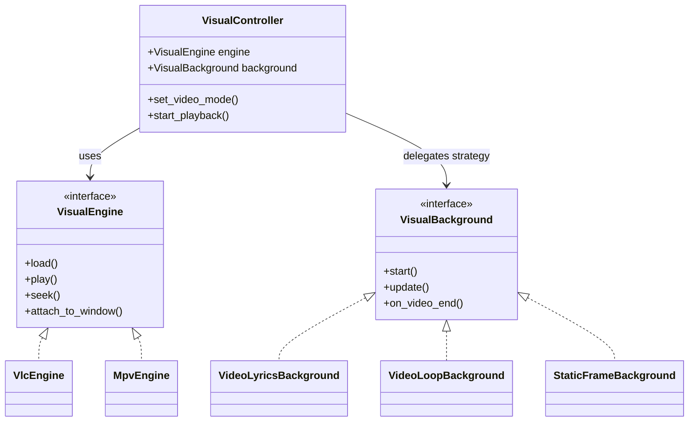

# Video Module Architecture

The `video` module has been refactored into a **decoupled architecture** to separate concerns and facilitate future backend migrations (e.g., from VLC to mpv).

## Overview

The new architecture consists of three main components:

1.  **VisualController** (`VideoLyrics` in `video.py`): The main orchestrator (QWidget). Handles UI, coordinates the engine and background, and interfaces with the rest of the application.
2.  **VisualEngine** (`video/engines/`): Abstraction for the low-level video player backend.
3.  **VisualBackground** (`video/backgrounds/`): Abstraction for the high-level playback strategy.

## Components

### 1. VisualController (`VideoLyrics`)
Located in `video/video.py`.
- **Role:** High-level controller.
- **Responsibilities:**
    - Managing the UI window (screens, positioning).
    - Initializing the correct `VisualEngine` (currently `VlcEngine`).
    - Selecting the `VisualBackground` strategy based on the configured mode (`full`, `loop`, `static`, etc.).
    - Routing commands to the active engine and background.

### 2. VisualEngine (`video/engines/`)
Base interface: `VisualEngine` in `video/engines/base.py`.

- **VlcEngine** (`video/engines/vlc_engine.py`):
    - Current production implementation using `python-vlc`.
    - Handles window attachment (HWND/XID/NSView).
    - Manages legacy hardware optimizations.
- **MpvEngine** (`video/engines/mpv_engine.py`):
    - Stub implementation for future migration to `mpv`.

### 3. VisualBackground (`video/backgrounds/`)
Base interface: `VisualBackground` in `video/backgrounds/base.py`.

Strategies define *how* the video behaves relative to the audio:

- **VideoLyricsBackground** (`full` mode):
    - Synchronizes video with audio.
    - Handles offset and elastic/hard corrections from `SyncController`.
- **VideoLoopBackground** (`loop` mode):
    - Plays a video in a continuous loop.
    - Independent of audio position.
- **StaticFrameBackground** (`static` mode):
    - Displays a single frozen frame.
    - Optimized for legacy hardware.
- **BlankBackground** (`none` mode):
    - Displays nothing (video disabled).

## Architecture Diagram



## Usage

The `VideoLyrics` class remains the public API for the application.

```python
# VideoLyrics is initialized normally
video_controller = VideoLyrics(screen_index=1)

# Usage remains the same
video_controller.set_media("path/to/video.mp4")
video_controller.show_window()
video_controller.start_playback(audio_time=0.0)
```
